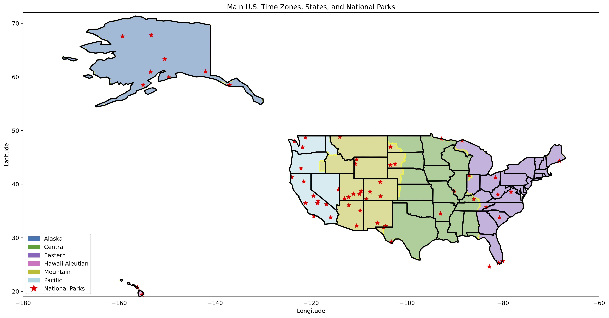

# GeoReason

<h1>GeoReason: Understanding Geospatial Reasoning in LLMs</h1>

<!-- [**Xiangcheng Hu**](https://github.com/JokerJohn)1 · [**Jin Wu**](https://zarathustr.github.io/)1 · [**Mingkai  Jia**](https://github.com/MKJia)1· [**Hongyu  Yan**](https://scholar.google.com/citations?user=TeKnXhkAAAAJ&hl=zh-CN)1· [**Yi  Jiang**](https://yijiang1992.github.io/)2· [**Binqian  Jiang**](https://github.com/lewisjiang/)1
 
[**Wei Zhang**](https://ece.hkust.edu.hk/eeweiz)1 · [**Wei  He**](https://sites.google.com/view/drweihecv/home/)3 · [**Ping Tan**](https://facultyprofiles.hkust.edu.hk/profiles.php?profile=ping-tan-pingtan#publications)1*&dagger;

1**HKUST&emsp;&emsp;&emsp;2CityU&emsp;&emsp;&emsp;3USTB**
 
&dagger;project lead&emsp;*corresponding author -->

<!-- 

    <a href="https://mapeval.github.io/">🌐 Website</a> •
    <a href="https://huggingface.co/papers/2501.00316">📃 Paper</a> •
    <a href="https://huggingface.co/MapEval">🤗 Dataset</a> •
    <a href="https://paperswithcode.com/paper/mapeval-a-map-based-evaluation-of-geo-spatial">🏆 Leaderboard</a> •
    <a href="https://github.com/orgs/mapeval/repositories">💻 Code</a>

 -->

  

## 📢 Updates

<!-- -   2024-12-31: We have released our [paper](https://arxiv.org/abs/2501.00316) and [dataset](https://huggingface.co/MapEval). Check it out! -->
-   2025-06-06 Paper submitted to SIGSPATIAL 2025 Conference

## 📖 Abstract

Geospatial reasoning is central to a wide range of real-world applications, from navigation to urban planning. As large language models (LLMs) are increasingly deployed in spatial decision-support systems, it is crucial to assess their ability to reason about geographic space. Existing benchmarks often conflate geospatial reasoning with factual recall or retrieval-augmented generation (RAG), leaving open the question of whether LLMs can genuinely perform qualitative spatial reasoning. We introduce GeoReason, a novel benchmark that evaluates LLMs on three fundamental spatial relations, topology, direction, and distance—using real-world U.S. geographic entities. The benchmark is structured into two tiers: GeoReason-T1, which focuses on single-relation reasoning tasks, and GeoReason-T2, which challenges models with multi-step, compositional queries. Through an evaluation of five leading LLMs, GPT-4, Claude, Gemini, DeepSeek, and LLaMA, we reveal that while models perform reasonably on atomic spatial queries, they struggle with integrating multiple spatial predicates. Observed from our results, LLMs exhibit distinct patterns in different geospatial reasoning: directional tasks elicit clearer reasoning behavior, while topological relations remain poorly structured and inconsistently reasoned, and distance-based tasks are usually grounded in predefined or real-world numeric information. GeoReason provides a focused, interpretable framework for diagnosing spatial inference gaps and guiding future research toward more robust, language-based geospatial AI.

## 🌎 GeoReason Overview

we introduce GeoReason, a novel benchmark de-
signed to evaluate large language models on three core geospatial reasoning tasks: topology, distance, and direction. Building on the intersection of spatial data and language-based reasoning, GeoReason explores the native qualitative geospatial reasoning abilities of foundation models, examining their performance on both simple and complex queries. In contrast to retrieval-heavy benchmarks,
GeoReason is designed to assess how well LLMs reason about real-world geography, probing the model’s internalized geospatial reasoning abilities acquired during pretraining. The benchmark is divided into two tiers: **GeoReason-T1** focuses on evaluating models‘ basic understanding of individual geospatial constructs, while
**GeoReason-T2** presents multi-step tasks that require reasoning across multiple geospatial dimensions. Building on the intersection of geospatial data and language-based reasoning, GeoReason provides a focused and interpretable framework for assessing the qualitative geospatial reasoning capabilities of foundation models.
By separating reasoning from retrieval and systematically structuring tasks by complexity, our benchmark supports more meaningful evaluation and development of spatially aware, language-based AI systems. To assess current capabilities, we evaluate five representative closed- and open-source LLMs—GPT, Gemini, DeepSeek, Claude, and Llama—across both tiers, analyzing their strengths and failure modes in fine-grained detail.

We show that LLMs exhibit distinct patterns in geospatial reasoning: they show the strongest reasoning ability in directional tasks, struggle with topology understandings,
and tend to rely on predefined numerical knowledge when han-
dling distance-related queries. By focusing on qualitative spatial understanding across both simple and compositional queries, our benchmark provides a holistic and interpretable framework for evaluating the geospatial reasoning abilities of foundation models.

| Formalism   | Concepts           | Predicates                | Spatial Concepts                                | Values                                                            |
|-------------|--------------------|----------------------------|--------------------------------------------------|-------------------------------------------------------------------|
| Topological | RCC8               | Polygon-Polygon            | DC, EC, PO, EQ, TPP, NTPP, TPPI, NTPPI           | disjoint, touch, overlap, equal, covered by, within, cover, contain |
| Directional | Cardinal Direction | Point-Point                | N, E, S, W, NE, SE, SW, NW                       | North, East, South, West, Northeast, Southeast, Southwest, Northwest |
| Distance    | Qualitative        | Point-Point, Point-Polygon | near, far                                       | nearest, farthest                                                 |

## 🗺️ Dataset Summary
GeoReason consists of **1,346** queries: **601** in **GeoReason-T1** and
**745** in **GeoReason-T2**. To ensure broad coverage and meaningful spatial diversity, we
focus on three well-structured U.S. geographies: national parks
(points), states (polygons), and time zones (polygons). Our selection of dataset ensures the benchmark is grounded in authoritative,
reproducible data. These regions are popular, publicly documented, and easily visualizable, making them ideal for LLM evaluation. Compared to existing benchmarks that tend to focus on smaller areas like a certain city or states, our GeoReason includes 1,346 question-answering instances spanning a diverse set of reasoning tasks, covers real-world U.S. geographic entities, including 63 national parks, all 50 states and one federal district, and 6 major time zones—covering the full U.S. spatial extent. Our data is sourced from the U.S. Census Bureau, U.S. Department of Transportation, and Wikipedia.

## 🏆 Benchmarking

We evaluate 8 variations of 5 LLMs in our experiments: GPT-4.1,
GPT-O3-Mini, Gemini-2.5-Pro, Gemini-2.5-Flash, DeepSeek-Chat,
DeepSeek-Reasoner, Claude-Sonnet-4, and Llama-3.3-70B. The models are evaluated on the basis of accuracy. The results are shown below:

<table>
  <thead>
    <tr>
      <th ></th>
      <th colspan="5">
GeoReason-T1</th>
      <th colspan="4">
GeoReason-T2</th>
      <th ></th>
    </tr>
    <tr>
      <th >Model</th>
      <th>Topology</th>
      <th>Direction</th>
      <th>Distance (Near)</th>
      <th>Distance (Far)</th>
      <th>T1 Avg</th>
      <th>Topo+Dir</th>
      <th>Topo+Dist</th>
      <th>Dir+Dist</th>
      <th>T2 Avg</th>
      <th >Avg</th>
    </tr>
  </thead>
  <tbody>
    <tr>
      <td>deepseek-chat</td><td>15.62</td><td>62.54</td><td>50.79</td><td>85.71</td><td>68.89</td><td>3.39</td><td>5.56</td><td>18.11</td><td>9.02</td><td>31.34</td>
    </tr>
    <tr>
      <td>deepseek-reasoner</td><td>30.63</td><td><b>77.46</b></td><td>61.90</td><td>96.83</td><td>78.45</td><td>11.86</td><td><b>15.64</b></td><td>52.76</td><td>26.75</td><td><b>46.73</b></td>
    </tr>
    <tr>
      <td>gpt-4.1</td><td>13.12</td><td>70.79</td><td>61.90</td><td>19.05</td><td>55.29</td><td>0.00</td><td>5.00</td><td>22.83</td><td>9.28</td><td>25.25</td>
    </tr>
    <tr>
      <td>gpt-o3-mini</td><td><b>38.75</b></td><td>76.83</td><td><b>68.25</b></td><td>46.03</td><td>67.59</td><td><b>40.16</b></td><td>10.00</td><td>39.37</td><td><b>29.84</b></td><td>43.65</td>
    </tr>
    <tr>
      <td>gemini-2.5-pro</td><td>22.50</td><td>76.83</td><td>66.67</td><td><b>98.41</b></td><td><b>80.29</b></td><td>5.08</td><td>15.56</td><td><b>57.48</b></td><td>26.04</td><td>46.07</td>
    </tr>
    <tr>
      <td>gemini-2.5-flash</td><td>16.88</td><td>62.54</td><td>63.49</td><td>69.84</td><td>69.05</td><td>1.69</td><td>8.89</td><td>29.13</td><td>13.24</td><td>33.21</td>
    </tr>
    <tr>
      <td>claude-sonnet-4</td><td>29.38</td><td>59.05</td><td>58.73</td><td>28.57</td><td>55.44</td><td>3.39</td><td>10.56</td><td>28.35</td><td>14.10</td><td>29.02</td>
    </tr>
    <tr>
      <td>llama-3.3-70B</td><td>24.38</td><td>65.71</td><td>52.38</td><td>0.00</td><td>48.79</td><td>0.02</td><td>6.11</td><td>15.75</td><td>7.29</td><td>21.45</td>
    </tr>
    <tr>
      <td><b>Average</b></td><td>23.84</td><td>69.43</td><td>61.68</td><td>63.49</td><td>54.61</td><td>64.75</td><td>9.37</td><td>10.17</td><td>35.43</td><td>18.32</td>
    </tr>
  </tbody>
</table>

## Contact
- Shaolin Xie: shaolinx@usc.edu

## 📝 Citation

**BibTeX**:

COMING SOON...
